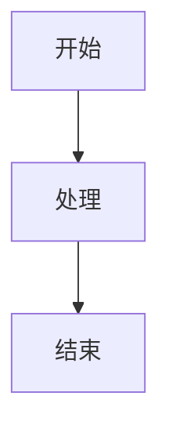

# 📝 个人博客与知识库平台

在线演示-> cainsgl.top

<div align="center">

一个基于 Vue 3 构建的现代化个人博客和知识库平台，支持 PWA、Markdown 编辑、实时聊天等功能。

[](https://vuejs.org/)
[](https://vitejs.dev/)
[](https://arco.design/)
[](LICENSE)

</div>

---

## ✨ 功能特性

### 📱 PWA 渐进式 Web 应用
- 🚀 一键安装到桌面/主屏幕，像原生应用一样使用
- ⚡ 离线缓存，更快的加载速度
- 🎨 全屏体验，支持 Window Controls Overlay
- 🔄 自动更新，智能缓存策略（API、图片、静态资源分级缓存）
- 🔗 PWA 链接拦截，无缝跳转体验
- 📸 应用截图展示，增强安装 UI
- 🎯 快捷方式支持（首页、知识库、个人主页、消息中心）
- 详见：[PWA 安装指南](docs/pwa-guide.md)

### 🎨 主题系统
- 🌓 **明暗主题切换** - 支持浅色/深色/自动三种模式
- 🔄 **跟随系统** - 自动模式可跟随系统主题变化
- 🎯 **PWA 标题栏适配** - 主题色自动同步到 PWA 标题栏
- 💾 **云端同步** - 主题设置可跨设备同步
- 🎨 **自定义颜色** - 支持自定义主题色

### � 多端适配
- 💻 **桌面端优化** - 1920px+ 大屏完美展示
- 📱 **移动端适配** - 完整的移动端交互体验
- 📐 **平板适配** - 768px-1024px 中等屏幕优化
- 🔄 **响应式布局** - 所有页面均支持响应式设计
- 👆 **触摸优化** - 移动端手势操作支持
- � **断点设计** - 480px / 768px / 1024px / 1200px / 1400px

### ✍️ 强大的 Markdown 编辑器
- 📝 **实时预览** - 所见即所得的编辑体验
- 🎨 **代码高亮** - 支持 100+ 编程语言（Highlight.js）
- 🧮 **数学公式** - KaTeX 渲染，支持行内和块级公式
- 📊 **Mermaid 图表** - 流程图、时序图、甘特图等
- 🎬 **多媒体支持** - 视频、音频、GIF 动图上传与播放
- 🖼️ **图片处理** - 自动压缩、裁剪、预览
- 🎵 **音乐播放器** - 内置音乐播放器组件
- 📹 **视频播放器** - 支持倍速、进度控制
- 🔗 **文章引用** - 支持引用其他文章
- � **目录生成** - 自动生成文章目录
- 🎯 **自定义语法** - 扩展 Markdown 语法

### 📚 知识库管理
- 🌲 **树形目录** - 多级目录结构，拖拽排序
- 📖 **文章管理** - 创建、编辑、删除、移动
- 🔖 **版本控制** - 文章历史版本管理
- ⭐ **收藏夹** - 多收藏夹分组管理
- 🔍 **全文搜索** - 快速查找文章和用户
- 🎯 **文章推荐** - 智能推荐相关文章
- 🔒 **权限管理** - 公开/私有知识库
- 📊 **统计分析** - 阅读量、点赞数统计

### 💬 实时聊天系统
- 🔌 **WebSocket 通信** - 实时消息推送
- 💬 **会话管理** - 会话列表、删除、置顶
- 📨 **消息通知** - 未读消息提醒
- 😊 **表情支持** - Emoji 表情选择器
- ✅ **已读状态** - 消息已读/未读标记
- 🔔 **消息中心** - 回复、点赞、系统消息统一管理

### 👤 用户系统
- 🔐 **多种登录方式** - 密码登录、验证码登录、第三方登录（Bilibili）
- 👥 **社交功能** - 关注/粉丝系统、互相关注
- 📅 **签到系统** - 每日签到、签到日历、经验值奖励
- 🏆 **等级系统** - 用户等级、升级动画
- 🎨 **个人主页** - 自定义头像、背景、简介
- 📝 **内容管理** - 文章、知识库、收藏、历史记录
- ☁️ **云端同步** - 用户设置云端存储
- 🔒 **隐私设置** - 屏蔽用户、隐私保护

### 💬 评论互动
- 💭 **段落级评论** - 可对文章任意段落评论
- 🔗 **评论回复** - 多级回复支持
- 👍 **点赞功能** - 文章、评论点赞
- ⭐ **收藏功能** - 收藏文章到收藏夹
- 📢 **举报系统** - 内容举报与审核

### 🎯 其他特色功能
- 🎪 **轮播图** - 首页轮播展示
- 📢 **公告系统** - 系统公告发布与展示
- 📁 **文件管理** - 云端文件上传与管理
- 🖼️ **图片压缩** - 自动压缩优化图片
- 📊 **数据统计** - 阅读量、点赞数、收藏数
- 🔍 **搜索功能** - 文章、用户全局搜索
- 📱 **分享功能** - 文章分享到其他应用（PWA）
- 🎨 **Three.js 特效** - 登录页 3D 背景动画
- ⚡ **性能优化** - 代码分割、懒加载、Gzip/Brotli 压缩

---

## 🚀 快速开始

### 环境要求

- Node.js >= 16
- npm >= 8 或 pnpm

### 安装

```bash
# 克隆项目
git clone https://github.com/yourusername/blog-frontend.git

# 进入项目目录
cd blog-frontend

# 安装依赖
npm install
```

### 开发

```bash
# 启动开发服务器
npm run dev

# 访问 http://localhost:36033
```

### 构建

```bash
# 构建生产版本
npm run build

# 预览构建结果
npm run preview

# 分析打包体积
npm run analyze
```

---

## 📦 技术栈

### 核心框架
- **Vue 3** - 渐进式 JavaScript 框架
- **Vite** - 下一代前端构建工具
- **Vue Router** - 官方路由管理器
- **Pinia** - 状态管理

### UI 组件库
- **Arco Design Vue** - 字节跳动企业级设计系统
- **自定义组件** - 高度定制化的业务组件

### Markdown 相关
- **@kangc/v-md-editor** - Vue Markdown 编辑器
- **Marked** - Markdown 解析器
- **Highlight.js** - 代码高亮
- **KaTeX** - 数学公式渲染
- **Mermaid** - 图表绘制

### 其他核心库
- **Axios** - HTTP 客户端
- **Three.js** - 3D 图形库
- **DOMPurify** - XSS 防护
- **Compressor.js** - 图片压缩
- **TypeIt** - 打字机效果

### PWA 支持
- **vite-plugin-pwa** - PWA 插件
- **Workbox** - Service Worker 工具集

---

## 📂 项目结构

```
blog-frontend/
├── public/                 # 静态资源
│   ├── screenshots/       # PWA 截图
│   └── *.png             # 图标文件
├── src/
│   ├── api/              # API 接口
│   ├── assets/           # 资源文件（样式、图片）
│   ├── components/       # 组件
│   │   ├── base/        # 基础组件
│   │   ├── comment/     # 评论组件
│   │   ├── home/        # 首页组件
│   │   ├── kb/          # 知识库组件
│   │   ├── layout/      # 布局组件
│   │   ├── loginModal/  # 登录模态框
│   │   ├── md/          # Markdown 组件
│   │   └── post/        # 文章组件
│   ├── composables/      # 组合式函数
│   ├── config/           # 配置文件
│   ├── plugins/          # 插件
│   ├── router/           # 路由配置
│   ├── services/         # 服务层
│   ├── store/            # 状态管理
│   ├── utils/            # 工具函数
│   ├── views/            # 页面视图
│   ├── App.vue           # 根组件
│   └── main.js           # 入口文件
├── docs/                 # 文档
├── vite.config.js        # Vite 配置
├── package.json          # 项目配置
└── README.md             # 项目说明
```

---

## 📖 文档

### 功能文档
- [PWA 安装指南](docs/pwa-guide.md) - PWA 安装和使用说明
- [PWA 配置说明](docs/pwa-config-final.md) - PWA 详细配置文档
- [视频上传功能](docs/video-upload-usage.md) - 视频和 GIF 上传使用指南
- [聊天功能使用](docs/chat-usage.md) - 实时聊天功能说明
- [用户设置说明](docs/user-setting-usage.md) - 用户设置和偏好配置
- [云同步指南](docs/cloud-sync-guide.md) - 数据云端同步说明

### 技术文档
- [PWA 自定义指南](docs/pwa-customization.md) - PWA 自定义开发
- [PWA 窗口控制](docs/pwa-window-controls-overlay.md) - 标题栏自定义
- [PWA 链接处理](docs/pwa-link-handler.md) - 链接拦截和处理
- [PWA 截图指南](docs/pwa-screenshots-guide.md) - 应用截图配置
- [PWA 验证清单](docs/pwa-validation-checklist.md) - PWA 功能验证

### 更多文档
- [用户设置 UI](docs/user-settings-ui.md) - 用户设置界面设计
- [视频功能总结](docs/video-feature-summary.md) - 视频功能实现总结

---

## 🔧 配置说明

### API 配置

在 `src/config/index.js` 中配置后端 API 地址：

```javascript
export default {
  apiBaseUrl: 'https://your-api-domain.com',
  wsBaseUrl: 'wss://your-api-domain.com'
}
```

### PWA 配置

在 `vite.config.js` 中自定义 PWA 配置：

```javascript
VitePWA({
  manifest: {
    name: '你的应用名称',
    short_name: '简称',
    description: '应用描述',
    theme_color: '#f7f8fa',
    background_color: '#ffffff',
    // ... 更多配置
  },
  workbox: {
    // 缓存策略配置
    runtimeCaching: [
      {
        urlPattern: /^https:\/\/api\..*/i,
        handler: 'NetworkFirst', // API 优先网络
      },
      {
        urlPattern: /\.(png|jpg|jpeg|svg|gif|webp)$/i,
        handler: 'CacheFirst', // 图片优先缓存
      }
    ]
  }
})
```

### 主题配置

在 `src/assets/style/global.less` 中自定义全局样式：

```less
// 自定义主题色
@primary-color: #165DFF;
@success-color: #00B42A;
@warning-color: #FF7D00;
@danger-color: #F53F3F;

// 自定义间距
@size-1: 4px;
@size-2: 8px;
@size-3: 12px;
// ...
```

### 环境变量

创建 `.env.local` 文件配置环境变量：

```bash
# API 地址
VITE_API_BASE_URL=https://your-api-domain.com
VITE_WS_BASE_URL=wss://your-api-domain.com

# 应用配置
VITE_APP_TITLE=你的应用名称
VITE_APP_DESCRIPTION=应用描述
```

---

## 🎯 核心功能说明

### PWA 安装与使用

**安装方式：**
1. 访问网站后等待 3 秒自动弹出安装提示
2. 或点击浏览器地址栏的安装图标
3. 确认安装即可

**PWA 特性：**
- 支持 Window Controls Overlay（自定义标题栏）
- 离线访问，缓存策略智能分级
- 快捷方式支持，快速访问常用页面
- 分享目标，其他应用可分享内容到本应用

### 主题切换

**三种模式：**
- **浅色模式** - 默认浅色主题
- **深色模式** - 护眼深色主题
- **自动模式** - 跟随系统主题自动切换

**切换方式：**
- 点击右上角主题切换按钮
- 在用户设置中选择主题模式
- 主题设置会自动保存并云端同步

### Markdown 编辑

**基础语法：**
支持标准 Markdown 语法，包括标题、列表、引用、代码块等。

**扩展语法：**

```markdown
# 视频播放器
:::video 文件ID 视频名称.mp4
:::

# 音乐播放器
:::music 文件ID 音乐名称.mp3
:::

# 文章引用
:::post 文章ID
:::

# 数学公式（行内）
$E = mc^2$

# 数学公式（块级）
$$
\int_{-\infty}^{\infty} e^{-x^2} dx = \sqrt{\pi}
$$

# Mermaid 流程图

```

**快捷键：**
- `Ctrl/Cmd + B` - 加粗
- `Ctrl/Cmd + I` - 斜体
- `Ctrl/Cmd + K` - 插入链接
- `Ctrl/Cmd + S` - 保存

### 实时聊天

**功能特点：**
- WebSocket 实时通信，消息即时送达
- 支持文本消息和表情
- 会话列表管理，支持删除会话
- 未读消息提醒，消息已读状态
- 消息历史记录，分页加载

**使用方法：**
1. 点击用户头像进入个人主页
2. 点击"发消息"按钮
3. 在聊天窗口输入消息并发送

### 知识库管理

**创建知识库：**
1. 进入"知识库"页面
2. 点击"创建知识库"
3. 填写名称、描述、选择公开/私有
4. 创建完成后可添加文章和目录

**目录管理：**
- 支持多级目录结构
- 拖拽排序（开发中）
- 文章移动和复制
- 目录折叠展开

**权限设置：**
- 公开知识库：所有人可见
- 私有知识库：仅自己可见

### 签到与等级

**签到系统：**
- 每日签到获得经验值
- 签到日历查看本月签到记录
- 连续签到额外奖励（开发中）

**等级系统：**
- 经验值累积升级
- 升级动画效果
- 等级徽章展示

### 多端适配说明

**响应式断点：**
- **超大屏** (1920px+) - 完整布局，三栏展示
- **大屏** (1400px-1920px) - 标准布局，两栏展示
- **中屏** (1024px-1400px) - 紧凑布局，部分侧边栏隐藏
- **平板** (768px-1024px) - 平板布局，单栏展示
- **手机** (480px-768px) - 移动布局，垂直堆叠
- **小屏** (<480px) - 小屏优化，最小化元素

**移动端优化：**
- 触摸手势支持
- 底部导航栏
- 抽屉式菜单
- 优化的触摸目标尺寸
- 移动端专属交互

---

## 🤝 贡献

欢迎提交 Issue 和 Pull Request！

1. Fork 本仓库
2. 创建特性分支 (`git checkout -b feature/AmazingFeature`)
3. 提交更改 (`git commit -m 'Add some AmazingFeature'`)
4. 推送到分支 (`git push origin feature/AmazingFeature`)
5. 提交 Pull Request

---

## 📝 开发计划

### 近期计划
- [ ] 知识库目录拖拽排序
- [ ] 连续签到奖励机制
- [ ] 文章草稿箱功能
- [ ] 文章定时发布
- [ ] 更多 Markdown 扩展语法

### 中期计划
- [ ] 移动端 App（React Native / Flutter）
- [ ] 国际化支持（i18n）
- [ ] 更多第三方登录（微信、QQ、GitHub）
- [ ] 文章导出功能（PDF、Word）
- [ ] 协作编辑（多人实时编辑）

### 长期计划
- [ ] AI 辅助写作
- [ ] 更多图表类型（ECharts 集成）
- [ ] 插件系统
- [ ] 主题市场
- [ ] 桌面客户端（Electron）

---

## 📄 许可证

本项目采用 [MIT](LICENSE) 许可证。

---

## 🙏 致谢

- [Vue.js](https://vuejs.org/)
- [Arco Design](https://arco.design/)
- [Vite](https://vitejs.dev/)
- 所有贡献者

---

## 📮 联系方式

如有问题或建议，欢迎通过以下方式联系：

- 💬 提交 [Issue](https://github.com/CainSgl/blog-front/issues)
- 📧 发送邮件至：cainsgl80@gmail.com
- 🌐 访问网站：[cainsgl的小站](#cainsgl.top)

---

<div align="center">

**如果这个项目对你有帮助，请给一个 ⭐️ Star 支持一下！**

Made with ❤️ by [CainSgl](https://github.com/CainSgl)

</div>
